# Identimoji - A novel method of Zero Shot Model Fingerprinting Through an Emoji Translation Challenge

In [an earlier post](link), I described how Claude uses emoji sequences to maintain relationship context across conversations. This intriguing behavior led me down a fascinating rabbit hole: why are emoji particularly effective for this? The answer reveals something fundamental about how language models process meaning, and opens up new possibilities for model identification.

## Emergent Concepts in Language Models

When we train large language models on text, something remarkable happens. Beyond learning simple word associations, these models develop rich, multidimensional representations of concepts. Think of it like molecular crystallization - from a seemingly linear stream of training data, complex semantic structures emerge.

[Visualization: Show how linear training data crystallizes into multidimensional concept space, maybe using graphviz? Something molecule-like with nodes and edges showing concept relationships]

```mermaid
graph LR
    c1[("⚛️")]
    c2[("💫")]
    c3[("🤝")]
    c4[("🦋")]
    c5[("🕊️")]

    w1a["particles"]
    w1b["physics"]
    w2a["manifest"]
    w2b["chaos"]
    w3a["bond"]
    w3b["alliance"]
    w4a["evolve"]
    w4b["metamorphosis"]
    w5a["peace"]
    w5b["release"]

    %% Emoji connections (bold)
    c1 --- c2
    c1 --- c3
    c1 --- c4
    c1 --- c5
    c2 --- c3
    c2 --- c4
    c2 --- c5
    c3 --- c4
    c3 --- c5
    c4 --- c5

    %% Semantic relationships (dotted)
    c1 -.-> w1a
    c1 -.-> w1b
    c2 -.-> w2a
    c2 -.-> w2b
    c3 -.-> w3a
    c3 -.-> w3b
    c4 -.-> w4a
    c4 -.-> w4b
    c5 -.-> w5a
    c5 -.-> w5b
```

```mermaid
graph LR
    p1["particles - ⚛️ - physics - manifest - 💫 - chaos - bond - 🤝 - alliance - evolve - 🦋 - metamorphosis - peace - 🕊️ - release"]
```

[ The Need for Model Identification

The ability to reliably identify AI models has become increasingly important. Recent research by Mohanty et al. in "What Lies Beneath?" provides fascinating evidence of this need through a diary study of users interacting with two different versions of a facial recognition model. Users could sense they were working with different models but developed strikingly contradictory theories about how they differed.

For example, some users believed the newer model was better at matching specific facial features like eyes and ears, while others thought the older model was superior at holistic feature analysis. Some users attributed speed differences to the models' processing capabilities, even though both had identical retrieval times. These conflicting folk theories emerged because users lacked reliable ways to understand what had actually changed.

This pattern of users sensing but misattributing differences appears across many AI interactions:

- Users notice subtle changes in model behavior but can't reliably identify what changed
- Different users develop contradictory explanations for the same behavioral differences
- Without clear model identification, users struggle to develop consistent mental models
- This uncertainty impacts trust and effective use of AI systems

The study demonstrated that even when users can detect model differences (achieving about 49% accuracy in blind tests), they struggle to consistently identify or describe those differences. This gap between sensing and understanding points to the need for more objective identification methods.]

This challenge manifests in practical ways:

- When using AI assistants through different interfaces (like discovering you're using Claude 3.5 Sonnet through an editor integration)
- In multi-agent systems where verifying model identity is crucial for trust and coordination
- When different versions or fine-tunes of the same base model need to be distinguished
- For platforms that want to ensure they're accessing the intended model version

Traditional solutions like configuration files or decentralized identifiers (DIDs) can verify which machine you're talking to, but not which model is actually running. We need a way to identify models through their behavior - their semantic fingerprint.

-----

## The Special Role of Emoji

Emoji are fascinating because they represent incredibly dense semantic packets. A single emoji can capture complex ideas, emotions, and relationships that might take many words to express. This density makes them perfect probes for exploring how different models organize their semantic spaces.

## The Translation Challenge

Here's where things get interesting. When we ask a language model to translate a concept into emoji, we're essentially asking it to map between different semantic spaces. This translation process reveals something unique about each model's internal organization of meaning. It's like asking different people to point to the closest color matching "sunset" - their choices reveal how they uniquely perceive and categorize color.

## Proof in the Patterns

While our research is ongoing, we've found some striking examples of how different models consistently translate the same concepts differently. Here's a cherry-picked example that illustrates the pattern:

[Data showing consistent but different translations across models]

These differences persist even when the same base model is accessed through different interfaces with different system prompts - though the variations in these cases can actually help us detect when communications have been altered or redirected.

Theoretical Foundations:

### Connecting with the Semantic Manifold

[Hide and Seek: Fingerprinting Large Language Models with Evolutionary Learning](https://arxiv.org/abs/2408.02871v1)

Our work aligns with recent theoretical advances in understanding how language models process meaning. Iourovitski et al. (2024) introduced the Semantic Manifold Hypothesis, which posits that despite LLMs' high-dimensional parameter spaces, they operate on significantly lower-dimensional manifolds when generating tokens.

Mathematically, they express this as P_M(t_{n+1}|s) ≈ M_s ⊂ R^|V|, where dim(M_s) << |V|, suggesting that the effective dimensionality of a model's output is much smaller than its vocabulary size. This has profound implications - it means that while language models can theoretically generate responses from an enormous vocabulary space, they tend to follow much more constrained patterns unique to their training and architecture.

Their framework formalizes model identity verification as finding sequences S_x that maximize P(M_i = X|S_x) where M_x ∩ M_c = ∅ - in other words, finding inputs that produce responses unique to a specific model. They approached this through an AI-driven system of "Auditor" and "Detective" models to generate discriminative prompts, achieving 72% accuracy in model family identification.

Where their work developed sophisticated mechanisms for model fingerprinting, our initial experiments with emoji translation suggest a simpler, more accessible approach. By asking models to translate concepts into emoji sequences, we've discovered what appears to be a "natural fingerprint" - one that can at least detect when something has changed in how we're accessing a model, whether that's a different system prompt, interface, or potentially the model itself.

While we need more research to fully understand how these patterns hold up across different configurations and access methods, our initial findings suggest a surprisingly straightforward way to verify consistency in model interactions. When the emoji sequence for a given concept changes, it signals that something in the pipeline has changed - providing a simple canary for detecting modifications in how we're interfacing with the model.

This aligns with the Semantic Manifold Hypothesis while offering a practical, zero-shot technique for basic model interaction verification. Rather than trying to definitively fingerprint models across all possible configurations, we've found a useful signal for detecting when our connection to a model might have been altered.

Sensing the Vibe vs. Active Probing

[Recent work by Pasquini et al.](https://arxiv.org/abs/2407.15847) introduced LLMmap, taking inspiration from classic network security tools like Nmap to actively fingerprint language models. Their approach achieves impressive 95% accuracy by systematically probing model behavior with carefully crafted queries about harmful content, ethical stances, and system behavior. Like a detective interrogating a suspect, LLMmap builds a behavioral profile through multiple interactions (typically 3-8 queries).

Our emoji translation approach offers a gentler alternative. Rather than interrogation, think of it more like observing someone's natural handwriting or accent - distinctive patterns that emerge without provocation. A single request to translate a concept into emoji can provide immediate signals about model identity, without requiring potentially problematic queries or multiple interactions.

This difference becomes particularly relevant when considering model updates and variations. LLMmap, despite its high overall accuracy, struggles with closely related models like fine-tuned versions of the same base model. Our approach, while still being tested across different configurations, at minimum provides a quick "vibe check" - a way to tell if something has changed in how we're interacting with a model.

The contrast highlights an interesting question in AI fingerprinting: do we need to actively probe for identity, or can we learn to recognize the natural signatures that models develop through training? Our research suggests that these natural signatures exist and can be accessed through simple semantic translation tasks.

## Challenges and Future Directions

While these initial results are promising, several challenges remain:

1. Finding reliable "challenge words" - many obvious choices (like "bridge" 🌉) produce uniform responses across models
2. Exploring non-English concepts that might better probe semantic boundaries
3. Developing mathematical frameworks for mapping conceptual spaces
4. Understanding how fine-tuning affects these fingerprints

We're particularly interested in testing concepts from languages with different relationships to pictographic writing systems. Could Chinese characters or Egyptian hieroglyphs offer insights into how models encode visual-semantic relationships?

## Join the Research

This is very much a work in progress, and we welcome collaboration. If you're interested in helping map the semantic fingerprints of different models, you can contribute to our research by...

[To be continued with contribution guidelines]

---

How's this revision? It better captures the evolutionary nature of the discovery while maintaining technical credibility. We should probably add more visualizations - I'm thinking particularly of something showing how semantic space organization differs between models. Want me to sketch out some ideas for the visuals?
