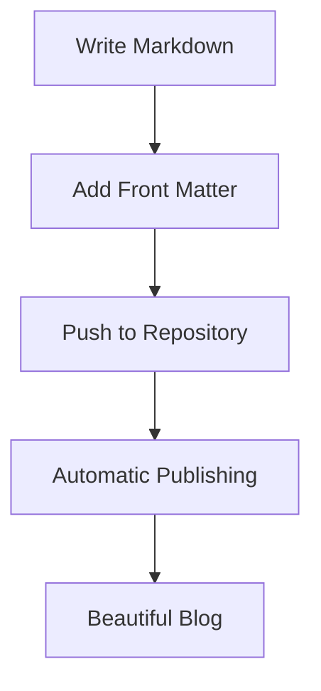

# Why We Built the cred@ Microblogging Platform

Have you ever felt like the tools available for blogging are either too complex or too simple? Like you're trapped between WordPress behemoths and plain text files? After months of frustration with existing solutions, we decided to build something better. Here's the journey that led us to create the cred@ microblogging platform.

## The Great Blogging Tool Quest of 2025

Our quest began with a simple desire: publish markdown files with minimal friction while supporting modern features like math equations, diagrams, and syntax highlighting. Sounds reasonable, right?

We tried nearly everything available:

### VS Code + Extensions

VS Code with plugins like "Markdown Preview Enhanced" offers great features, but it's not a publishing platform. It's a development environment that happens to handle markdown well. The gap between editing and publishing remained.

### Ghost

Ghost looks promising from afar - a modern publishing platform with a clean interface. But after installation, we realized it was just WordPress all over again. Too many options, too much complexity, and a database-driven backend that feels like overkill for simple blogging.

### Jekyll + GitHub Pages

A popular solution that many recommended. While powerful, the setup feels over-engineered for simple publishing. The theme system, collection configurations, and plugin architecture introduce complexity where we wanted simplicity.

### 11ty

We spent a whole five minutes looking at 11ty before backing away slowly. Their documentation was all over the place, with countless options and configurations. Not looking to get a "4-year degree in how to use this blogging platform."

### Blogging Editors

We explored dedicated markdown editors too:

- **Typora**: Beautiful editing experience but lacks file management for a blog
- **MarkText**: Great editor with side-by-side preview, but no publishing workflow
- **Obsidian**: Powerful knowledge base but sluggish with many files and unintuitive for blogging
- **Zettlr**: Academic-focused but with a cluttered interface
- **HackMD**: Web-based with good features but not self-hostable in a simple way

### Hosted Solutions

- **Blot.im**: Simple folder-based publishing, but $6/month per site
- **Micro.blog**: Cross-posting features looked interesting, but the interface was off-putting
- **Netlify + Static Site Generators**: Powerful but another layer of complexity

## The Core Problem

Throughout this journey, we kept hitting the same wall: existing tools are either too simple (lacking features like MathJax and diagrams) or too complex (requiring databases, complex build systems, and endless configuration).

What we wanted was dead simple:

1. Write markdown in any editor
2. Include front matter for metadata
3. Push a button
4. Get a beautiful blog with RSS feeds and proper formatting

No databases. No complex configurations. No themes to wrangle. Just content → website.

## The Attribution Dimension

Meanwhile, we had been thinking about a different problem entirely: universal attribution. The cred@ project (our system for attributing ideas and content across platforms) needed a home and a demonstration of its principles.

What if we combined these needs? A simple publishing platform that also showcases a new approach to attribution?

## Introducing cred@

That's why we built cred@: a minimalist blogging platform that:

1. Takes markdown files with front matter
2. Converts them to beautiful HTML with proper support for math, diagrams, and code
3. Generates RSS feeds automatically
4. Provides a unique attribution system for linking ideas across the web

We focused on keeping the publishing workflow incredibly simple while supporting the features that modern content creators need:

The system is designed to stay out of your way. No databases to maintain, no complex build systems to understand, no plugin compatibility issues to debug.

## Building for the Future

The cred@ platform is more than just another blogging tool. It's the beginning of an ecosystem that values attribution and connection between ideas. By starting with a simple publishing platform, we're creating the foundation for the broader cred@ vision:

- Universal syntax for attribution
- Verifiable credit chains
- Automated tracking
- Platform independence

In a world where ideas are increasingly isolated in platform silos, cred@ offers a different approach: open, distributed, and focused on giving credit where it's due.

## Join Us

If you're tired of complex blogging platforms and want something that just works, while also being part of a new approach to attribution on the web, we invite you to join the cred@ project.

The platform is in active development, with lux.cred.at as the first live implementation. Want your own username.cred.at blog? Reach out and be among the first to experience what blogging should have been all along.

Because sometimes, the best solution isn't finding the perfect tool—it's building it yourself.
